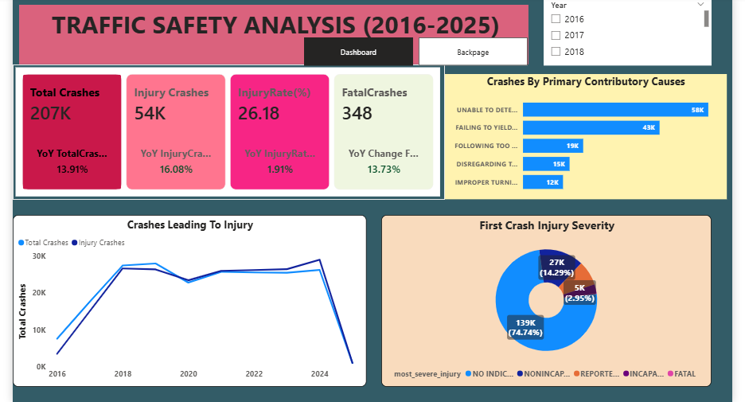
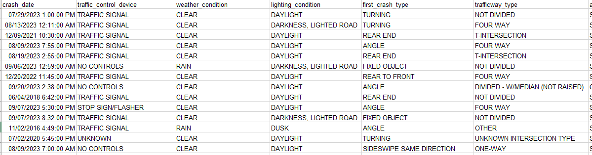

#  TRAFFIC SAFETY ANALYSIS (2016-2025)
## Analyzing a 10-years traffic accident data to understand various factors that lead to the accident reported and the suggested actions to prevent further occurrence using Power BI.

## Executive Summary
- The traffic management does not have a clear and accurate traffic crash pattern of the accident which happened across different regions of the city in the last decades.
- Prepare a clear and interactive Power BI using over 200,000 data to track various accident related KPI, primary contributory cause of an accident , time most accident and level of severity etc.
- Delivered a centralized data-driven report solution which will assist the Mayor and his team to see the large number of crashes, the amount of injury crashes and some other related facts that are hidden .
- It was also revealed that the major contributory  causes of accidents are “UNABLE TO DETERMINE” and the highest crashes occurred in the year 2024.

## The Major Problem
The Mayor needs a data-driven approach to understand the pattern of accidents in the region between the year 2016-2025 which could help justify the incoming year budget and guide the leadership to make the appropriate decisions.
### Key Questions Addressed:
- Rate of change of crashes
- Major crashes contributory causes
- High-risk roadways and prime time when most crashes occur
  
## The Process (Methodology)
### Tools Used:
Power BI, Power Query, DAX
### Data Sourcing & Overview
The dataset consists of over 200,000 crash accidents data with 24 columns, of alpha-numeric data of crashes which occurred between 2016-2025.
### Data Cleaning & Transformation 
- Using Power Query, the raw data was transformed to ensure accuracy:
- Removed duplicate entries from the dataset.
- Created a new Crash Time calculated column.
- Created another column for month number.
- Removal of null rows from the dataset
- Created separate columns as datetable .

##  Analysis & Insights
This section breaks down every visualization into actionable stories.

### Crashes and KPI pattern
- The total crashes recorded is more than 200,000  for the period under review and a YoY change of 13.91% when compared to the previous year.
- Between the year 2016 to 2019, there was an increase in the rate of accident crashes but this wasn’t the case in the year 2020 where the crash rate dropped drastically to a total of 23,000.
- But in the year 2021 and 2022, the crash rate remains unchanged by maintaining 26,000 crashes; however there are other places where there is variation in the factors leading to those crashes.
- From the total crashes between the year under review, there are about 54,000 total injury crashes which also increased by 16.08% between 2024 to 2025.
- The injury rate also stood at 26.18% for the period under review while it maintains 1.91% YoY change between 2024 to 2025.

  ### Breakdown of Primary Contributory Causes
The primary contributory causes of accident is “UNABLE TO DETERMINE” which is accountable for over 58,000 crashes closely followed by “ FAILING TO YIELD RIGHT-OF-WAY” which also accounted for 43,000 crashes .

### Crashes Leading to Injury Breakdown
Major injury leading to crashes occurred in the year 2024 where out of over 26,000 crashes , over 7,000 lead to injury .

### Breakdown of Crashes by the Time
Most crashes occurred between 3pm to 5pm with the highest crashes at 5pm with a total count of over 15,000 followed by 4pm also at over 15,000 while at 3pm we have over 14,000 crashes.

##  Recommendations
- Deploy speed cameras, red-light cameras, and mobile patrols in high-risk corridors.
- Focus enforcement on top contributory causes.
- Speed calming measures (rumble strips, speed bumps) should be introduced.
- Implement real-time traffic monitoring and automated violation detection.
- Faster response times to reduce fatalities and severity, even if crashes occur.
- Use digital platforms to track repeat offenders and enforce penalties consistently.

  ## Link
  [PowerBI Interactive Link](https://app.powerbi.com/view?r=eyJrIjoiZjgyY2YxNDItMmExNC00ZDNmLTk1N2YtOGQ0NGE3MTIzZmE5IiwidCI6IjY0M2NkODIwLWU2YzYtNGI2ZC05ZDc5LTJjOTgwOTllMTg3MCJ9)

